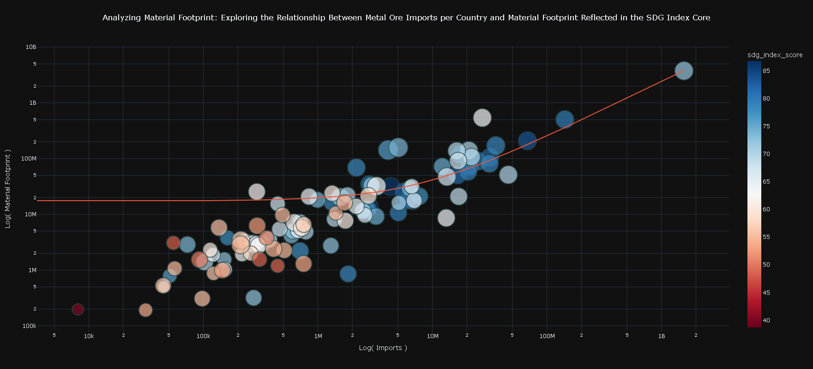
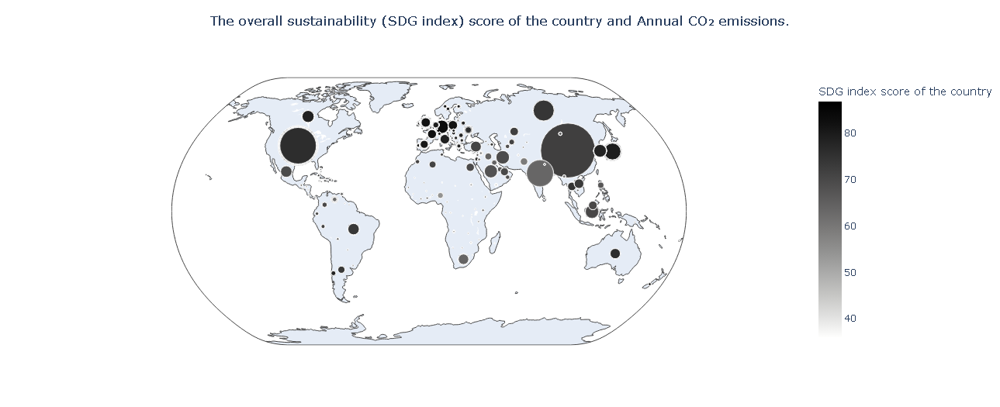
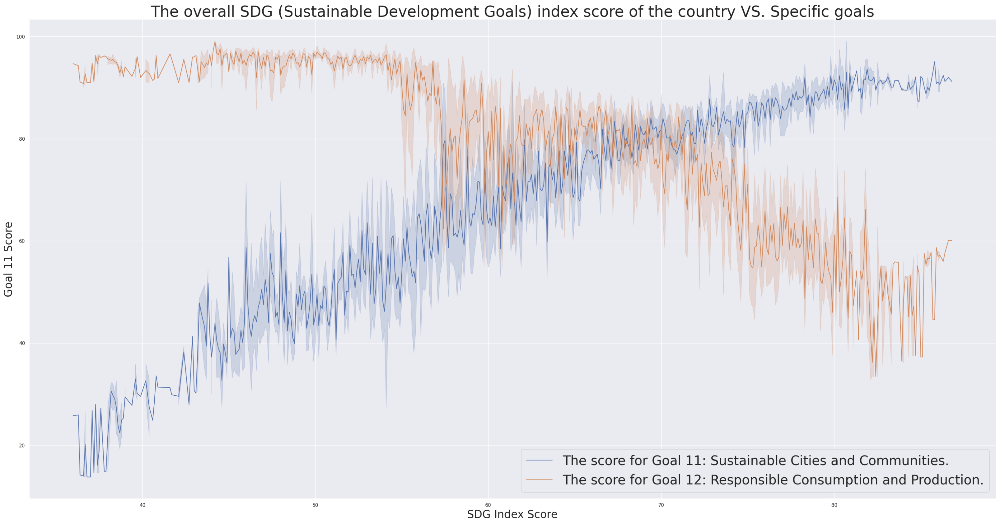

# Global Sustainability Data Journalism Project

[](https://www.python.org/downloads/release/python-3100/)
[](https://opensource.org/licenses/MIT)
[](https://plotly.com/)

An in-depth data analysis and visualization project exploring the complex relationships between economic indicators, CO2 emissions, and the UN's Sustainable Development Goals (SDGs).

[DEVPOST - D.AI Data Journalism Challenge 2024 Honorable mention: Technical Award](https://devpost.com/software/awareness-of)





**Live Project Report:** [View the Deployed Report](https://kaidalisohaib.github.io/DAIJChallenge24/)  

---

## Table of Contents

- [Global Sustainability Data Journalism Project](#global-sustainability-data-journalism-project)
  - [Table of Contents](#table-of-contents)
  - [About The Project](#about-the-project)
  - [Key Features](#key-features)
  - [Tech Stack](#tech-stack)
  - [Project Architecture](#project-architecture)
  - [Getting Started](#getting-started)
    - [Prerequisites](#prerequisites)
    - [Installation](#installation)
  - [Usage](#usage)
  - [Technical Challenges \& Lessons Learned](#technical-challenges--lessons-learned)
    - [1. Data Wrangling and Integration](#1-data-wrangling-and-integration)
    - [2. Crafting Insightful Visualizations](#2-crafting-insightful-visualizations)
  - [Future Improvements](#future-improvements)
  - [License](#license)

## About The Project

This project was developed for the **Dawson AI Data Journalism Challenge 2024**. The primary objective was to investigate the intricate and often non-obvious connections between a country's economic activities (such as manufacturing exports), its environmental impact (measured by CO2 emissions), and its progress toward global sustainability targets.

The central problem this project addresses is that raw data on sustainability and economics is vast and difficult to interpret. It's challenging to see how a country's industrial output directly correlates with its material footprint or its overall SDG score. This project bridges that gap by:
1.  **Integrating** multiple diverse datasets into a unified analytical framework.
2.  **Analyzing** the cleaned data to uncover significant trends, correlations, and outliers.
3.  **Visualizing** these findings through interactive and insightful charts that tell a compelling story.
4.  **Presenting** the narrative in a polished web-based report to make the conclusions accessible to a broad audience.

## Key Features

-   **Comprehensive Data Integration:** Merges disparate datasets on SDG scores, CO2 emissions, GDP, and global trade to create a holistic view for analysis.
-   **In-depth Exploratory Data Analysis (EDA):** Employs statistical methods and visualizations to uncover correlations between variables like metal ore imports, material footprint, and national sustainability scores.
-   **Interactive & Multi-Dimensional Visualizations:** Leverages the Plotly library to create dynamic scatter plots, geo-maps, and line charts, allowing for deeper data exploration by the user.
-   **Narrative-Driven Web Report:** Presents the key findings and visualizations in a polished `index.html` page, effectively communicating a data-driven story about global sustainability.

## Tech Stack

-   **Data Analysis & Visualization:** Python, Pandas, NumPy, Matplotlib, Seaborn, Plotly
-   **Environment:** Jupyter Notebooks (run within VS Code)
-   **Frontend:** HTML5, CSS3

## Project Architecture

The project follows a classic data analysis workflow, structured to ensure a clear separation of concerns from data acquisition to final presentation.

1.  **Data Layer:** Consists of raw data sourced from multiple `.csv` files, covering topics from SDG indices to country-specific CO2 emissions and trade statistics.
2.  **Analysis Layer:** The core of the project resides in the Python scripts (`analysis.py`, `Copy_of_DawsonAI_Data_Journalism_Workshop.py`). These scripts handle all data wrangling, including cleaning, merging, and transformation using Pandas. They then generate the static and interactive visualizations using Matplotlib, Seaborn, and Plotly.
3.  **Presentation Layer:** The final output is an `index.html` page with custom CSS. This static site serves as the project report, embedding the generated visualizations and contextualizing them with analysis and narrative to communicate the key insights discovered.

## Getting Started

To get a local copy up and running, follow these simple steps.

### Prerequisites

-   Python 3.10 or later
-   `pip` (Python package installer)
-   `venv` module (usually included with Python)

### Installation

1.  **Clone the repository:**
    ```sh
    git clone https://github.com/kaidalisohaib/DAIJChallenge24.git
    cd DAIJChallenge24
    ```
2.  **Create and activate a virtual environment:**
    - On macOS/Linux:
      ```sh
      python3 -m venv venv
      source venv/bin/activate
      ```
    - On Windows:
      ```sh
      python -m venv venv
      .\venv\Scripts\activate
      ```
3.  **Install the required dependencies:**
    ```sh
    pip install -r requirements.txt
    ```

## Usage

There are two primary ways to interact with this project:

1.  **View the Final Report:**
    The easiest way to see the project's findings is to open the `index.html` file in your favorite web browser.
    ```sh
    # On macOS
    open index.html

    # On Windows/Linux
    # (Navigate to the file and double-click it)
    ```

2.  **Reproduce the Analysis:**
    The analysis scripts (`analysis.py` and `Copy_of_DawsonAI_Data_Journalism_Workshop.py`) are structured like Jupyter notebooks. You can run them cell-by-cell in a compatible IDE like Visual Studio Code with the Python extension to see the data processing and visualization steps firsthand.

## Technical Challenges & Lessons Learned

This section highlights key technical hurdles faced during development and the skills demonstrated in overcoming them.

### 1. Data Wrangling and Integration

-   **The Problem:** The project required integrating several datasets with different schemas, naming conventions for countries, and timeframes. Aligning data from SDG, CO2 emissions, and trade sources was challenging and led to initial issues with missing values and mismatched keys during merges.
-   **The Solution:** I used the `pandas` library extensively to standardize the data. This involved renaming columns for consistency, using the `.merge()` function with careful key selection, and implementing a strategy to handle `NaN` values with `.dropna()`. This process created a single, clean, and cohesive DataFrame ready for analysis.
-   **What I Learned:** This project was a powerful lesson in the criticality of meticulous data preprocessing. I honed advanced `pandas` techniques for data alignment and cleaning, reinforcing the principle that robust analysis is built on a foundation of high-quality, well-structured data.

### 2. Crafting Insightful Visualizations

-   **The Problem:** It's one thing to plot data, but another to create a visualization that tells a clear story. The goal was to represent a multi-dimensional relationship (e.g., CO2 emissions vs. Exports, colored by SDG score, with point size representing another variable) on a single, readable chart.
-   **The Solution:** I leveraged `plotly.express` for its power in creating complex, interactive visualizations with concise code. I strategically mapped different data variables to visual channels like `x`, `y`, `color`, `size`, and `hover_name`. A key decision was to use logarithmic scales (`log_x=True`, `log_y=True`) to effectively manage wide data distributions and reveal underlying trends that would otherwise be obscured.
-   **What I Learned:** I developed a strong practical understanding of data visualization design principles. This project taught me to think like a storyteller, using visual encodings and interactive elements in Plotly not just to display data, but to guide the user's exploration and make complex relationships intuitive.

## Future Improvements

-   **Automate the Visualization Pipeline:** Refactor the analysis scripts into modular functions that automatically generate and save all required charts (as `.html` or `.png`) to the `website-related/assets` directory. This would create a fully reproducible pipeline from raw data to final report.
-   **Deploy as an Interactive Web App:** Transition the project from a static HTML page to a dynamic web application using a framework like **Streamlit** or **Dash**. This would allow users to apply their own filters (e.g., by region, year, or income level) and interact with the data in real-time.
-   **Expand the Dataset:** Incorporate additional time-series data to analyze trends over a longer historical period. This could enable the development of a simple predictive model to forecast a country's SDG score based on its recent economic and environmental performance.

## License

Distributed under the MIT License. See `.gitignore` for more information (although the license file itself is not present, MIT is a standard choice).